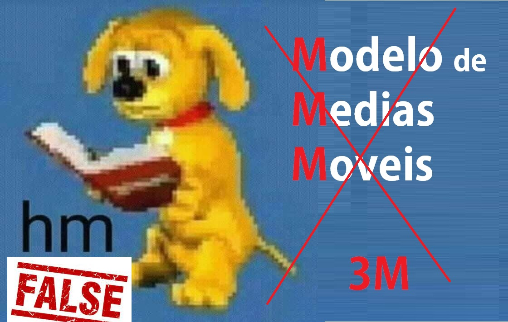
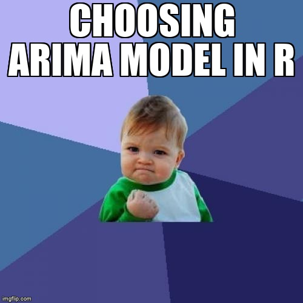
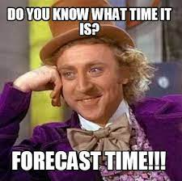

```{r setup, include=FALSE}
knitr::opts_chunk$set(echo = TRUE, class.source="Rchunk",class.output="Rout",fig.align='center')
```

```{r include=FALSE}
library(tidyverse)
library(tidyquant)
library(gridExtra)
library(tibbletime)
library(forecast)
library(itsmr)
library(here)
library(bbmle)
library(tseries)
library(fpp2)
library(ggthemes)
library(readr)
library(xts)
library(reshape)
require(timeDate)
require(ggplot2)
```


```{r message=FALSE, warning=FALSE, include=FALSE}
theme_stonks <- function (base_size = 11, base_family = "") {
theme_classic()+
theme(plot.background = element_rect(fill = "#2F3136", colour = "#2F3136"),
        panel.background = element_rect(fill = "#2F3136",colour = "#2F3136"),
        axis.text.x = element_text(face="bold", color="#F7F7F7"),
        axis.text.y = element_text(face="bold", color="#F7F7F7"),
        axis.title = element_text(color="#F7F7F7"),
        title = element_text(colour = "#F7F7F7"))
}
```


## Sobre a 3M

<br>
<p style='text-align: justify;'> 


|       A **3M** é uma empresa fundada 1902 em Minnesota e atua nos segmentos: Segurança e indústria (adesivos, fitas, sistemas de fechamento e mascaramentos, etc), Transporte e Eletônicos (soluções automotivas, aeroespaciais, materiais de displays e sistemas, etc), Saúde (superimentos médicos e cirúrgicos, por exemplo) e de Consumo (produtos para casa, papelaria, etc).


Entre suas Inovações estão :

* Lixa d'agua — A 3M criou a primeira lixa a prova d'agua do mundo, o que tornou as demais lixas obsoletas. {width="70px"}

* Fita de mascaramento - Permitia que as montadoras usassem mais de uma pintura em seus veículos. {width="70px"}

* Scotch Tape — Uma fita adesiva super resistente, que ajudava a consertar quase todos os objetos quebrados. Aqui no Brasil essa fita é mais conhecida pelo nome "Durex". {width="70px"}

* Fitas dupla-face — {width="70px"}

* Post-it — Sim! o post-it que tanto usamos no nosso dia a dia. {width="70px"}


</p>
<br>


# Banco de dados

<br>


|       A nossa base de dados consiste na data e no preço de fechamento das ações da 3M entre 04/03/2020 e 01/05/2020. O nosso principal objetivo é criarmos um modelo que nos ajudará a prever 10 dias a frente o preço de fechamento da ação.

|       A título de curiosidade, o período que estamos analisando está dentro de um acontecimento chamado de "Corona Crash", basicamente o "Corona Crash" ocorreu entre 20/02/20 até 07/04/20, esse periodo foi marcado por uma grande queda nos índices de bolsas mundiais relacionados não somente a falta de confiança dos investidores com as decisões economicas tomadas por presidentes de diversos países, mas tambem ao avanço do Coronavirus no mundo. 
  

<br>


```{r echo=FALSE, message=FALSE, warning=FALSE}
#lendo dados
library(RCurl)
stocks_3M <- read.csv(url("https://raw.githubusercontent.com/JairParra/Stock_market_prediction/master/data_raw/stocks_data_3M.csv"))

# selecionando as "colunas" data e "fechamento"
stocks_3M_data <- select(stocks_3M, Date, Close)
stocks_3M_data2=stocks_3M_data
stocks_3M_data2$Close <- round(stocks_3M_data$Close,2)

# convertendo "Data" em um objeto POSIXct 
dates <- as.POSIXct.Date(as.Date(stocks_3M_data$Date))

# convertendo em  objeto xts  
stocks_3M_data.ts <- xts(stocks_3M_data$Close, order.by = dates) 

```

<div style="text-align: justify">


Abaixo podemos dar uma olhada nas 10 primeiras observações de nossos dados:


</div>


```{r echo=FALSE, message=FALSE, warning=FALSE}
require(DT)

datatable(stocks_3M_data2, colnames = c('Data', 'Preço de Fechamento (USD)'),rownames = FALSE,options = list(searching = FALSE,
  initComplete = JS(
    "function(settings, json) {",
    "$(this.api().table().header()).css({'background-color': '#8EA8C3', 'color': '#fff'});",
    "}")
))%>% DT::formatStyle('Date',  color = 'white', backgroundColor = 'grey', fontWeight = 'bold') %>%DT::formatStyle('Close',  color = 'white', backgroundColor = 'grey', fontWeight = 'bold') 


```


# Análise Temporal

<br>
Agora, partiremos para uma análise mais visual de nosso banco de dados:
<br>

```{r echo=FALSE, message=FALSE, warning=FALSE}
#plot da série
autoplot(stocks_3M_data.ts,main="Preço de Fechamento das ações (3M) ") + 
  geom_line(colour="#D1345B",size=1)  +  # plots blue lines
  ggtitle("Preço de Fechamento das ações (3M)") + 
  geom_point(color="#D1345B")+
  theme_stonks()+xlab("Tempo")+ylab("USD")
```


<br>

|       Inicialmente podemos ver que o preço de fechamento da ação está relativamente alto, mas após o 1° dia ela começa a cair bastante, chegando em valores abaixo de USD$35,00. A queda mais acentuada se encontra do dia 12 de março, tambem conhecida como "Quinta-feira negra" foi o dia em que os mercados acionários globais sofreram a maior queda percentual em 1 único dia, o que tambem se reflete nas ações da 3M. E logo após essas consecutivas quedas, temos uma recuperação, uma grande sequencia do aumento do preço, ficando superior até mesmo que o valor inicial.
|       Com todo esse comportamento, temos fortes indícios de não estacionariedade, mas iremos analisar mais afundo abaixo através dos gráficos de ACF e PACF.

<br>

<br>


```{r echo=FALSE, message=FALSE, warning=FALSE}
# ACF e PACF
acf=ggAcf(stocks_3M_data.ts,color="#D1345B",size=1) + theme_stonks()+
  update_geom_defaults("segment", list(colour = "yellow",size = 0.8))+
  ggtitle("ACF")
  #update_geom_defaults("hline", list(colour = "white",size=0.8))

pacf=ggPacf(stocks_3M_data.ts,color="#D1345B",size=1) + theme_stonks()+
  update_geom_defaults("segment", list(colour = "yellow",size = 0.8))+
  ggtitle("PACF")
  #update_geom_defaults("hline", list(colour = "white",size=0.8))

gridExtra::grid.arrange(acf,pacf,ncol=2)
```
<br>

<br>

|       No ACF (Função de Autocorrelação) podemos ver que nossa serie possui muitos lags fora do intervalo de confiança, isso é um grande indicativo que a serie não é estacionaria.

|       Com base no PACF (Função de Autocorrelação Parcial) percebemos uma queda exponencial entre as primeiras lags ,o que pode ser um indicativo que utilizaremos um modelo $AR$ para o ajuste. 

<br>

<center>
{width="300px"}
</center>


# Modelagem

|       Inicialmente vamos ajustar 3 modelos que nos ajudarão a termos uma ideia do comportamento dos mesmos em relação a serie original. Usaremos os modelos:

<br>

* Linear 
* Polinomial de ordem 5 
* Médias Móveis de ordem 5 

<br>

<br>
```{r echo=FALSE, message=FALSE, warning=FALSE}
# ajustando vários modelos 
stocks_3M_linear <- tslm(ts(stocks_3M_data.ts)~trend)  
stocks_3M_p5 <- tslm(ts(stocks_3M_data.ts)~trend + I(trend^2) + I(trend^3) + I(trend^4) + I(trend^5) ) # polynomial
stocks_3M_ma5 <- ma(ts(stocks_3M_data.ts), order=5) # moving average
stocks_3M_trends <- data.frame(cbind(Data=stocks_3M_data.ts,  # stack in a dataframe
                                     Linear_trend=fitted(stocks_3M_linear),
                                     Poly_trend=fitted(stocks_3M_p5),
                                     Moving_avg5 = stocks_3M_ma5
))

# transformando objetos
stocks_3M_linear <- xts(fitted(stocks_3M_linear), order.by = dates)
stocks_3M_p5 <- xts(fitted(stocks_3M_p5), order.by = dates)

# gráficos
autoplot(stocks_3M_data.ts, colour="Original") + theme_stonks() +
  geom_line(aes(y=stocks_3M_linear, color="Original"),size=1) + 
  geom_line(aes(y=stocks_3M_linear, color="Linear"),size=1) + 
  geom_line(aes(y=stocks_3M_p5, color = "O(5) poly"), size=1) + 
  geom_line(aes(y=stocks_3M_ma5, color ="MA21"), size=1)  + 
  scale_color_manual(values = c('Original'= '#D1345B', 
                                'Linear' = '#58CD36',
                                'O(5) poly' = '#FF7420', 
                                'MA21'= '#05D5FA')) + 
  labs(color = 'Trend fit') +  ylab("USD") + 
  ggtitle("Ajuste dos 3 modelos no preço da ação") 


```
<br>

<br>

|       Com o gráfico acima e, analisando os ajustes, percebemos que o modelo Linear com certeza está descartado, pois está bem distante de nossa serie original. Já os modelos de Médias Móveis e o de Polinômio de grau 5 se encontam mais proximo de nossos dados.

|       Nesse sentido, analisaremos os resíduos, ACF e PACF do ajuste polinomial.

<br>

```{r echo=FALSE, message=FALSE, warning=FALSE}
stocks_3M_ma21 <- xts(stocks_3M_p5,order.by = dates) # cast to xts 
detrend_stocks_3M <- stocks_3M_data.ts - stocks_3M_p5 # substract from original

# Plot the residuals
autoplot(detrend_stocks_3M) + theme_stonks() + 
  ggtitle("resíduos ( O(5) trend)") +
  geom_hline(yintercept = 0, colour="blue",lty=2) + 
  geom_point(color="#FF7420") + ylab("USD - trend")  + geom_line(color="#FF7420",size=1)

# ACF
acf2=ggAcf(detrend_stocks_3M)+theme_stonks()+
  update_geom_defaults("segment", list(colour = "#FF7420",size = 0.8))+
  ggtitle("ACF")

# PACF 
pacf2=ggPacf(detrend_stocks_3M) + theme_stonks() +
  update_geom_defaults("segment", list(colour = "#FF7420",size = 0.8))+
  ggtitle("PACF")

grid.arrange(acf2,pacf2,ncol=2)
```

<br>

|       Com o gráfico dos resíduos acima, vemos que parece haver um comportamento estacionário em nossos dados depois que a tendência é removida, com seus valores em torno de 0. O que é confirmado no gráfico de ACF, apesar de uma se encontrar fora do intervalo de confiança, temos que as lags que se encaixam mais dentro de nossos intervalos. No entanto, já com os resíduos do PACF não temos tanta mudança, com lags passando muito do nosso intervalo de confiança.

|       Com isso vemos que através da forma Linear, ou Polinomial ou de Medias Moveis não conseguimos encontrar um bom ajuste para a nossa serie.

|       Com base nisso, a minha hipotese inicial e pessoal foi refutada, ou seja acabamos de descobrir que <span style="color: red;">**3M**</span> **NÃO É** um anagrama de Modelo de Médias Móveis:

<br>

<center>
{width="300px"}
</center>


<br>

|       Brincadeiras a parte, vamos seguir com a nossa análise...

<br>

# Arima

```{r include=FALSE}
stocks_3M_ma21 <- xts(stocks_3M_p5,order.by = dates) # cast to xts 
detrend_stocks_3M <- stocks_3M_data.ts - stocks_3M_p5 # substract from original

## conjunto treino
detrend_stocks_3M_train<-stocks_3M_data.ts[1:(round(length(detrend_stocks_3M))-10)] # 32
detrend_stocks_3M_test<-stocks_3M_data.ts[(round(length(detrend_stocks_3M))-9):length(detrend_stocks_3M)] # 10
str(detrend_stocks_3M_train)
str(detrend_stocks_3M_test)
length(detrend_stocks_3M_train)
length(detrend_stocks_3M_test)


# Ajustando modelo ARIMA
detrend_stocks_3M_arima_110 = auto.arima(detrend_stocks_3M_train, # use train data
                                         seasonal=TRUE, # allow SARIMA
                                         stepwise=FALSE, 
                                         max.d = 2, # max differencing order
                                         ic = c("aicc", "aic", "bic") , # selection criteria
                                         approximation=FALSE, # no approximation
                                         trace=TRUE) # show selection process

```


<br>

|       Com base em tudo isso que vemos, a partir de agora divideremos o nosso banco de dados em treino e teste, sendo 32 observações para treino do nosso modelo Arima e 10 observações que serão usadas para a validação do nosso modelo, testando as previsões.
|       Através da implementação no R, encontramos o melhor modelo que se ajustou aos nossos dados. Esse modelo é o $ARIMA(1,1,0)$ , ou seja, temos um modelo Autoregressivo de ordem 1 e, com 1 única diferenciação. 
Analisando algumas caracteristicas desse modelo, temos:

* Parâmetro autoregressivo : -0,4935 
* Erro Padrão : 0,1541   
* AIC : 1287,65
* BIC : 130,52

como: $|2*0,1541|<|-0,4935|=0,3082<0,4935$ então temos um bom processo de estimação.

### Checando os Resíduos

<br>

```{r echo=FALSE, fig.keep='all', results='hide'}

#+theme_stonks()

theme_set(theme_stonks())
with_theme_economist <- function(expr) {
  orig <- theme_get()
  theme_set(theme_stonks())
  force(expr)
  theme_set(orig)
}

with_theme_economist(checkresiduals(detrend_stocks_3M_arima_110,color="red"))
```
<br>

<br>

|       Desta forma, temos no primeiro gráfico, os resíduos do modelo, ele parece ter um comportamento mais estacionario em torno de 0.
|       No canto inferior esquerdo temos o gráfico da ACF, na qual todas as lags estão dentro de nosso intervalo de confiança
|       E no canto inferior direito temos o histograma dos nossos resíduos, o que nos mostra um comportamento Normal.

<br>

|       **Teste ADF: Dickey-Fuller**

|       Basicamente o teste de Dickey-Fuller testa a hipótese de se há ou não estacionariedade na nossa série.

<br>

<br>

$H_0:$ a série é nao estacionária

$H_1:$ a série é estacionária

<br>

```{r echo=FALSE, message=FALSE, warning=FALSE}
# Testes ADF 
detrend_stocks_3M_arima_110_diff <- diff(residuals(detrend_stocks_3M_arima_110), lag=1) # difference order 1
adf.test(detrend_stocks_3M_arima_110_diff,k=1) # ADF

```
<br>

|       Através do R, chegamos ao resultado acima. Como podemos notar, o nosso p valor é de 0,01 então, em um nível de significância de 5% temos evidências estatísticas para aceitarmos $H_1$ , ou seja, que nossa serie é estacionaria.


<br>


```{r echo=FALSE, message=FALSE, warning=FALSE}
# PACF 
pacf3=ggPacf(residuals(detrend_stocks_3M_arima_110)) + theme_stonks()+ggtitle("PACF") 

# raiz unitária
ru=autoplot(detrend_stocks_3M_arima_110) + theme_stonks()+ggtitle("Raiz Unitaria")

#g=grid.arrange(pacf3,ru,ncol=2)
g=ggpubr::ggarrange(pacf3,ru)

g2=cowplot::ggdraw(g) + 
  theme(plot.background = element_rect(fill="#2F3136", color = "#2F3136"))
plot(g2)
```

<br>


|       Vemos que a raíz do processo esta dentro do círculo unitário, ou seja, têm o módulo menor que 1, então temos que a 1° diferença do processo é estacionária.

 
|       Com todas as análises acima vemos que de fato nosso modelo ARIMA apresenta um desempenho satizfatório.

<br>

<center>
{width="300px"}
</center>

<br>

# Prevendo o Preço de Fechamento para os proximos 10 dias.

<br>

|       Agora que temos o nosso modelo 100% definido, partiremos para a previsão dos proximos 10 dias. Lembrando que como separamos os nossos dados em treino e teste, após a previsão poderemos comparar as previsões com as reais observações. Então #partiuuuu

<br>

<center>
{width="300px"}
</center>
<br>


<br>

```{r message=FALSE, warning=FALSE, include=FALSE, echo=FALSE, fig.keep='all', results='hide'}
# previsões 
detrend_stocks_3M_arima_110_forecasts <- forecast::forecast(detrend_stocks_3M_arima_110,h=10) # produce 10 forecasts
forecasted_trend <- forecast::forecast( stocks_3M_p5, h=10)  # forecast 10 trend observations

# 
forecast_table<-print(detrend_stocks_3M_arima_110_forecasts) %>%
  mutate(observed=detrend_stocks_3M_test,
         errors=`Point Forecast`-observed)

# 
forecast_table = as.data.frame(forecast_table)
colnames(forecast_table)<-c("Point_Forecast","Lo80","Hi80","Lo95","Hi95","observed","errors")

```


```{r echo=FALSE, message=FALSE, warning=FALSE, fig.keep='all', results='hide'}
forecast_table = as.data.frame(forecast_table)
colnames(forecast_table) <- c("Point_Forecast","Lo80","Hi80","Lo95","Hi95","observed","errors")
forecast_table

predicts <- c(rep(NA,32),forecast_table$Point_Forecast)
predicts_Lo80 <-  c(rep(NA,32),forecast_table$Lo80)
predicts_Hi80 <-  c(rep(NA,32),forecast_table$Hi80)
predicts_Lo95 <-  c(rep(NA,32),forecast_table$Lo95)
predicts_Hi95 <-  c(rep(NA,32),forecast_table$Hi95)


# Plotando previsões + xlim(1.05e+08,1.09e+08) + ylim(32,45) 
#autoplot(detrend_stocks_3M_arima_110_forecasts)  + theme_stonks()


autoplot(stocks_3M_data.ts, colour="orig") + theme_stonks() + 
  geom_line(aes(y=predicts,colour = "predito") ) +  # predictions
  geom_ribbon(aes(x=dates, ymin=predicts_Lo95,ymax=predicts_Hi95),fill="pink", alpha=.3) +  # 95% conf. bounds
  geom_ribbon(aes(x=dates, ymin=predicts_Lo80,ymax=predicts_Hi80),fill="blue", alpha=.5) +  # 80% conf. bounds
  scale_color_manual(values = c('predito'= 'red','orig'='black')) +  # colours and labels
  labs(color = 'Trend fit') + # label title
  ylab("USD") + xlab("Data")+  # axis labels
  geom_line(color="#58CD36") + # line colour
  geom_point() + # dots
  ggtitle("Predição do Preço da Ação para 10 dias") # title
stocks_3M_data.ts


```


<br>

|       Acima temos o gráfico com as 10 previsões, falaremos mais sobre ele logo abaixo.

<br>

```{r echo=FALSE, message=FALSE, warning=FALSE}
require(DT)
forecast_table$observed=as.numeric(forecast_table$observed)
forecast_table$observed=as.numeric(forecast_table$observed)
forecast_table$errors=as.numeric(forecast_table$errors)

forecast_table2=round(forecast_table,2)

datatable(forecast_table2,colnames=c("Previsão","LI80","LS80","LI95","LS95","Observado","Erro"), rownames = FALSE,options = list(searching = FALSE,
  initComplete = JS(
    "function(settings, json) {",
    "$(this.api().table().header()).css({'background-color': '#8EA8C3', 'color': '#fff'});",
    "}")
))%>% DT::formatStyle('Point_Forecast',  color = 'white', backgroundColor = 'grey', fontWeight = 'bold') %>%DT::formatStyle('Lo80',  color = 'white', backgroundColor = 'grey', fontWeight = 'bold') %>% DT::formatStyle('Hi80',  color = 'white', backgroundColor = 'grey', fontWeight = 'bold') %>%DT::formatStyle('Lo95',  color = 'white', backgroundColor = 'grey', fontWeight = 'bold')%>% DT::formatStyle('Hi95',  color = 'white', backgroundColor = 'grey', fontWeight = 'bold') %>%DT::formatStyle('observed',  color = 'white', backgroundColor = 'grey', fontWeight = 'bold')%>% DT::formatStyle('errors',  color = 'white', backgroundColor = 'grey', fontWeight = 'bold') %>%DT::formatStyle('observed',  color = 'white', backgroundColor = 'grey', fontWeight = 'bold')


```


<br>

|       Agora que temos o gráfico e a tabela acima podemos analisar melhor nossas previsões. A começar com as colunas `Predição` x `Observado` x `Erro`, nela podemos comparar diretamente o que foi predito x o real preço da ação. Dito isso, temos os pontos preditos muito próximos do valor real observado, com as maiores diferenças sendo no Dia 2, 8 e 10, com a diferença sendo 1,69 , -1,18 e 1,24, respectivamente. 
|       No entanto nossa análise não pode parar por ai, precisamos analisar tambem os intervalos de confiança e quando olhamos para a tabela e para o gráfico vemos eles são massivos! Quando olhamos para os limites Inferiores e Superiores, tanto de 80% quanto 95% de confiança, temos um intervalo grande demais, o que com toda certeza torna qualquer previsão em um tiro no escuro, dessa forma, por mais que tenhamos feito a estimação do valor para a ação, o intervalo que este valor pode variar é grande demais, o que compromete a confiabilidade da mesma.

<br> 

# Considerações Finais

|       Após as analises dos nossos dados e com a realização da previsão, vemos que inicialmente nosso modelo estava muito distante de uma real estacionariedade, mas após nossa 1° diferenciação conseguimos atingi-la. Tanto o os modelos usando médias móveis, polinomio e lineariedade não conseguiram expressar tão bem o comportamento das ações da 3M. Apenas através do Modelo $ARIMA(1,1,0)$ conseguimos um bom ajuste, no entanto, após a previsão nos deparamos com um intervalo muito grande, o que dificulta muito a credibilidade destas previsões.


<center>
<br>
|       BOM, ENTÃO É ISSO...FINALIZANDO O RELATÓRIO EM...
<br>

$$3...$$

$$2...$$
$$...$$
$$...$$
$$...$$
$$...$$

{width="600px"}


|       POR FIM, venho alarmar que descobi que <span style="color: red;">**3M**</span> na verdade se encaixa PERFEITAMENTE em MEME:

{width="500px"}

#pas
</center>